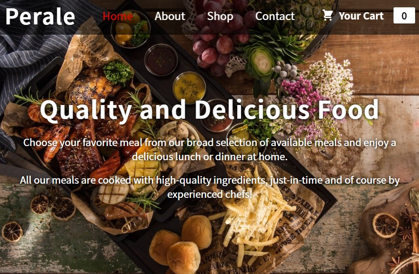

# PeraleRestaurant

## Demo

[**click live demo of the project**](https://dominiksiejka.github.io/PeraleRestaurant)



## Table of Contents

- [About the Project](#description)
- [How to use](#how-to-use)
- [Technologies used](#built-with)
- [Setup steps](#setup)
- [Sources](#sources)
- [License](#license)

## Description

PeraleRestaurant website. Order high quality-food remote from home with delivery. Get to know our delicious dishes and skilled staff. Passionate about cooking.

## How to use

Explore the PeraleRestaurant.

## Built with

- React
- React Hooks
- React Router
- Axios

## Setup

```
with BASH

# clone the remote repo to your local one
$ git clone https://github.com/dominiksiejka/PeraleRestaurant.git

# open the index.html file or use your code editor to open it with live server

```

## Sources

- Icons from [Font Awesome ](https://fontawesome.com)
- Font from [Google Fonts ](https://fonts.google.com/)

## License

- MIT © [Dominik Siejka ](https://github.com/dominiksiejka/PeraleRestaurant)
